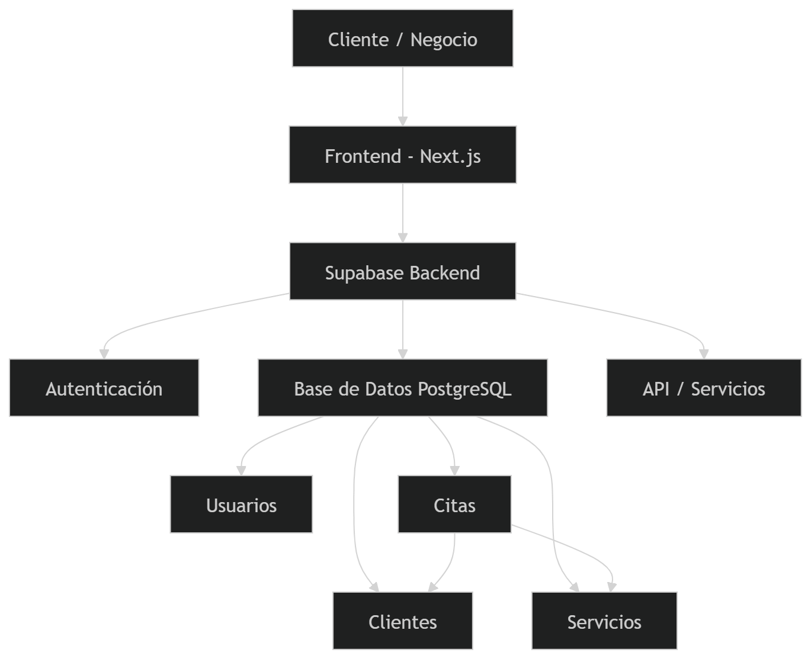

# ADR-01: Arquitectura de Mpact

| Campo  | Valor |
|--------|-------|
| Autor  | [HUMBERTO RAMIREZ] |
| Fecha  | 15/05/2026 |
| Estado | `Propuesto` |

---

## Contexto

Mpact es una aplicación web tipo SaaS dirigida a pequeños negocios locales como barberías, consultorios, gimnasios y emprendimientos que actualmente manejan sus operaciones de forma manual, ya sea por WhatsApp, libretas o agendas físicas.

El problema central es la desorganización en la administración de clientes, citas y servicios. Estos métodos manuales provocan citas duplicadas, pérdida de información de clientes, olvidos en los horarios y una atención poco eficiente que termina afectando al negocio.

El objetivo de Mpact es centralizar toda esa información en una sola plataforma que permita gestionar citas, clientes y servicios de manera sencilla. El público objetivo son dueños de negocios pequeños que necesitan una solución económica, accesible desde cualquier dispositivo y que no requiera conocimientos técnicos avanzados para usarse.

Como restricción principal, el proyecto será desarrollado por un equipo de estudiantes con tiempo y recursos limitados, por lo que las decisiones técnicas priorizan simplicidad y rapidez de desarrollo sin sacrificar una base sólida para crecer a futuro.

---

## Decisión

Se decidió utilizar una **arquitectura cliente-servidor con enfoque SaaS**, implementada con el stack de **.NET (ASP.NET Core)** en el backend y **React** en el frontend. La base de datos será **SQL Server** con acceso mediante **Entity Framework Core** como ORM.

### ¿Por qué?

**Arquitectura cliente-servidor SaaS**

Este modelo permite centralizar toda la lógica de negocio en el servidor y acceder al sistema desde cualquier dispositivo con navegador web. Al ser SaaS, cada negocio accede a su propia información sin necesidad de instalar nada, lo cual es fundamental para el perfil de usuario que estamos atendiendo. Además, facilita las actualizaciones y el mantenimiento ya que solo hay un punto de despliegue.

**Backend — ASP.NET Core Web API**

Se eligió ASP.NET Core porque ofrece un framework robusto y maduro para construir APIs REST. Su sistema de inyección de dependencias integrado facilita mantener el código organizado y testeable. Además, el patrón MVC que maneja .NET permite separar claramente la lógica de negocio, el acceso a datos y los controladores, lo que hace que el proyecto sea más fácil de mantener conforme crece. También es un framework con el que el equipo tiene experiencia académica previa.

**Frontend — React**

React permite construir interfaces de usuario dinámicas mediante componentes reutilizables. Para un sistema de gestión de citas donde la interfaz necesita actualizarse en tiempo real (por ejemplo, al agendar o cancelar una cita), el manejo de estado reactivo de React resulta ideal. Se complementa con Tailwind CSS para agilizar el diseño visual sin depender de archivos CSS extensos.

**Base de datos — SQL Server con Entity Framework Core**

Las entidades del sistema tienen relaciones claras entre sí: un negocio tiene usuarios, clientes y servicios; una cita vincula a un cliente con un servicio en una fecha específica. Este modelo relacional se mapea directamente a SQL Server, que además garantiza integridad referencial y transacciones ACID. Entity Framework Core actúa como ORM, lo cual reduce la cantidad de SQL manual y permite trabajar con objetos de C# directamente, acelerando el desarrollo.

**Autenticación — ASP.NET Core Identity**

Se utiliza el sistema de Identity integrado en .NET para manejar registro, login y roles de usuario. La ventaja es que ya viene integrado con el framework, soporta JWT para autenticación stateless en la API y evita tener que implementar un sistema de autenticación desde cero, reduciendo riesgo de vulnerabilidades de seguridad.

**Modelo de desarrollo — MVP**

Se decidió comenzar con un Producto Mínimo Viable enfocado en tres funciones esenciales: gestión de clientes, registro de servicios y administración de citas. Esto permite validar que la solución resuelve el problema real antes de invertir tiempo en funcionalidades avanzadas.

### Alternativas consideradas

| Alternativa | Por qué la descarté |
|-------------|---------------------|
| Node.js + Express | Aunque permite desarrollo rápido, carece de la estructura y tipado fuerte que ofrece .NET con C#. Para un proyecto que necesita crecer de forma ordenada, ASP.NET Core da más garantías de mantenibilidad a largo plazo. |
| Firebase (NoSQL + Auth) | Su estructura NoSQL basada en documentos complica el manejo de relaciones entre entidades como clientes, citas y servicios. Además, genera dependencia total con Google Cloud y limita la portabilidad del proyecto. |
| Django (Python) | Es un framework maduro con buen ORM, pero el equipo tiene mayor experiencia con C# y el ecosistema .NET. Elegir Django habría añadido curva de aprendizaje innecesaria dentro del tiempo disponible del cuatrimestre. |
| App móvil nativa (React Native) | Desarrollar una app móvil desde el inicio aumentaría la complejidad significativamente. Una aplicación web responsive cubre las mismas necesidades de accesibilidad móvil y permite entregar el MVP más rápido. |
| PostgreSQL | Es una excelente opción de base de datos relacional, pero SQL Server tiene mejor integración nativa con Entity Framework Core y el tooling de .NET (migraciones, scaffolding), lo cual agiliza el desarrollo. |

---

## Consecuencias

** Lo que gano:**

- **Técnica:** ASP.NET Core con Entity Framework Core y el patrón MVC proporciona una estructura clara donde cada capa tiene una responsabilidad definida. Esto hace que añadir nuevas funcionalidades (como un módulo de reportes o de pagos) sea cuestión de agregar un nuevo controlador y servicio sin tocar el resto del sistema. Además, el tipado fuerte de C# reduce errores en tiempo de ejecución que en lenguajes dinámicos solo se detectarían en producción.

- **Proceso y equipo:** Al usar un stack con el que el equipo ya tiene familiaridad (.NET y C#), el tiempo de arranque se reduce considerablemente. No hay curva de aprendizaje inicial, lo que permite enfocarse directamente en construir funcionalidad. Además, la documentación oficial de Microsoft y la comunidad de .NET son extensas, lo que facilita resolver problemas rápidamente durante el desarrollo.

** Lo que sacrifico o asumo:**

- **Limitación técnica:** SQL Server y el modelo relacional rígido implican que si el negocio necesita cambiar su estructura de datos significativamente en el futuro (por ejemplo, agregar campos dinámicos por tipo de negocio), las migraciones pueden volverse complejas. También, el despliegue de una aplicación .NET requiere más configuración de servidor que alternativas serverless como Firebase o Supabase.

- **Deuda o riesgo:** El MVP no incluirá funcionalidades que los usuarios probablemente pedirán pronto, como pagos en línea, notificaciones automáticas por WhatsApp o estadísticas avanzadas del negocio. Estas funciones requerirán integraciones con servicios externos (pasarelas de pago, API de WhatsApp Business) que añadirán complejidad al sistema. Además, si el número de negocios registrados crece significativamente, habrá que implementar una estrategia de multi-tenancy adecuada, lo cual no está contemplado en esta primera versión.

---

## Diagrama

A continuación se muestra el diagrama de arquitectura general de Mpact. El sistema se compone de un frontend en React que se comunica mediante peticiones HTTP con una API REST construida en ASP.NET Core. La API gestiona la lógica de negocio y accede a SQL Server a través de Entity Framework Core. La autenticación se maneja con ASP.NET Core Identity y JWT.

**Entidades principales de la base de datos:**
- **Usuarios** — dueños o empleados del negocio que acceden al sistema
- **Clientes** — personas que reciben los servicios del negocio
- **Servicios** — lo que el negocio ofrece (cortes, consultas, clases, etc.)
- **Citas** — vincula un cliente con un servicio en una fecha y hora específica
