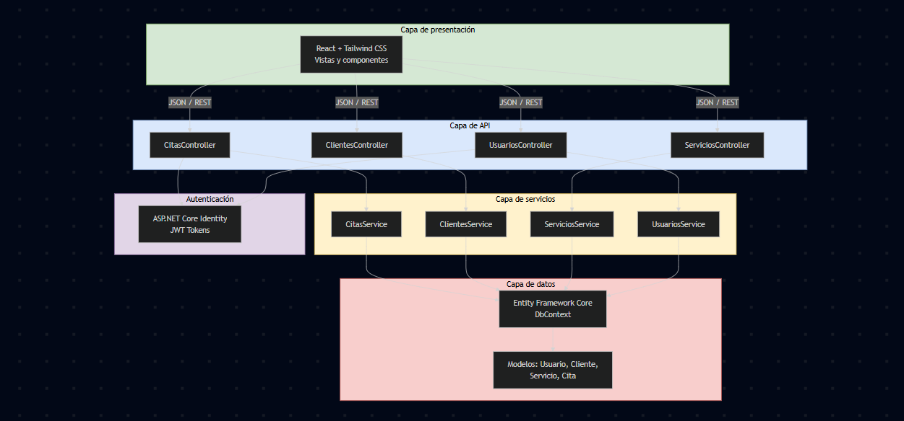
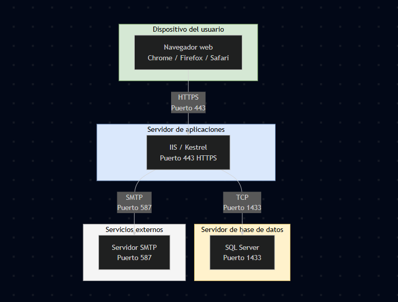
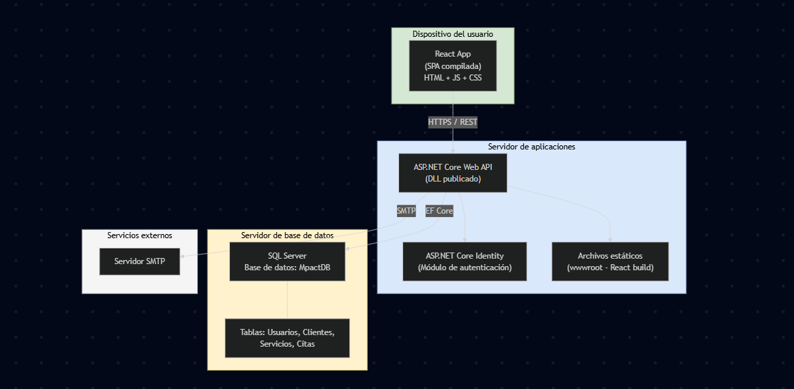
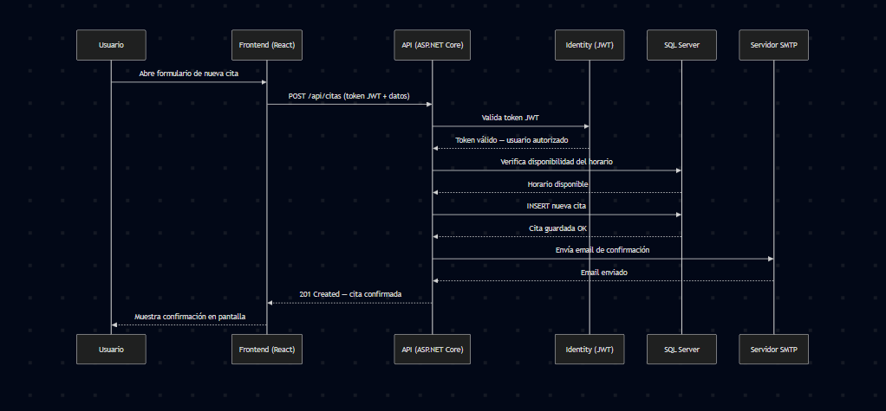

# ADR-02: Vistas arquitectónicas de Mpact

| Campo  | Valor |
|--------|-------|
| Autor  | Humberto Ramirez |
| Fecha  | 05/06/2026 |
| Estado | `Propuesto` |

---

## Contexto

Una vez definida la arquitectura base del sistema en el ADR-01 (cliente-servidor SaaS con ASP.NET Core, React y SQL Server), es necesario documentar cómo se organiza el sistema desde distintas perspectivas. Cada vista responde a una pregunta diferente sobre el diseño: cómo se estructura el código, dónde se ejecuta físicamente, cómo se despliega y cómo se comporta en tiempo de ejecución.

Estas vistas permiten que cualquier persona del equipo entienda el sistema sin necesidad de revisar todo el código, y sirven como referencia para tomar decisiones futuras de escalabilidad o mantenimiento.

---

## Decisión

Se decidió documentar la arquitectura de Mpact utilizando el **modelo de vistas 4+1**, seleccionando las cuatro vistas principales que aplican al alcance actual del proyecto:

- **Vista lógica** — organización interna del código en capas y responsabilidades
- **Vista física** — infraestructura de hardware y red donde opera el sistema
- **Vista de despliegue** — distribución de los artefactos de software en los nodos físicos
- **Vista de procesos** — comportamiento del sistema en tiempo de ejecución durante un flujo clave

### ¿Por qué?

El modelo 4+1 permite comunicar la arquitectura desde múltiples ángulos sin ambigüedad. Cada vista está dirigida a un stakeholder diferente: la vista lógica le sirve al desarrollador para saber dónde colocar código nuevo, la vista física al equipo de infraestructura para dimensionar recursos, la vista de despliegue para entender qué componente corre en qué servidor, y la vista de procesos para verificar que los flujos principales funcionan correctamente.

Al ser un proyecto desarrollado por estudiantes, documentar estas vistas obliga a pensar el sistema más allá del código y considerar aspectos como latencia, separación de responsabilidades y puntos de fallo.

### Alternativas consideradas

| Alternativa | Por qué la descarté |
|-------------|---------------------|
| Documentar solo con texto sin diagramas | No permite visualizar relaciones entre componentes de forma clara. Un párrafo describiendo la arquitectura se vuelve ambiguo rápidamente. |
| Usar solo la vista lógica | Una sola vista no cubre aspectos de infraestructura ni comportamiento en ejecución. El sistema necesita entenderse desde más de una perspectiva. |
| Modelo C4 completo (4 niveles de zoom) | El nivel 3 (componentes) y nivel 4 (código) requieren un grado de detalle que aún no existe en el proyecto. Las 4 vistas del modelo 4+1 cubren mejor las necesidades actuales. |

---

## Consecuencias

** Lo que gano:**

- **Técnica:** Tener la vista lógica documentada facilita que cualquier nuevo desarrollador entienda la separación en capas (Controllers, Services, Models, Data) y sepa exactamente dónde agregar una nueva funcionalidad sin romper la estructura existente.

- **Proceso y equipo:** Las vistas de despliegue y física sirven como guía para configurar los ambientes de desarrollo y producción. Esto evita que cada miembro del equipo configure el entorno de manera diferente y reduce errores de integración.

** Lo que sacrifico o asumo:**

- **Limitación técnica:** Los diagramas reflejan el estado actual del MVP. Cuando se agreguen funcionalidades como WebSockets para notificaciones en tiempo real o colas de mensajes para procesamiento asíncrono, las vistas de procesos y despliegue deberán actualizarse.

- **Deuda o riesgo:** La vista física asume un despliegue sencillo en un solo servidor de aplicaciones. Si el proyecto escala a múltiples instancias o se migra a contenedores, la infraestructura cambiará significativamente y estos diagramas quedarán desactualizados.

---

## Diagramas

### Vista lógica
Muestra la organización interna del código en capas, siguiendo el patrón MVC con una capa de servicios intermedia.

### Vista física
Muestra los nodos de hardware y la red donde opera el sistema.

### Vista de despliegue
Muestra qué artefacto de software se ejecuta en cada nodo físico.

### Vista de procesos
Muestra el flujo de ejecución cuando un usuario agenda una cita, que es la operación principal del sistema.

---

## Declaración de uso de IA

Se utilizó inteligencia artificial (Claude, Anthropic) como herramienta de apoyo. 
